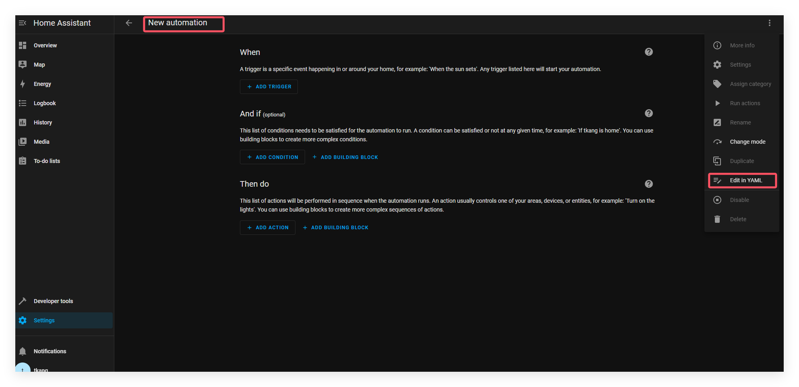

# 自动化YAML

**在HA中,自动化功能可以通过UI界面创建，但最终创建出来的自动化相关数据最终还是存储在YAML格式的文件中。这说明你也可以编辑YAML格式文件来修改自动化，如果你想编辑YAML来控制自动化，选择自动化，右上方处点击编辑YAML。不建议UI与YAML两种创建自动化的方式混用。**

UI方式将您的自动化信息写入`automation.yaml`。该文件只通过UI方式管理，**不应该手动编辑**。

如果确实需要手动编写方式实现自动化，在`configuration.yaml`中添加`automation`这个标签块，或者新建其他 YAML 文件，在其中写入你的自动化内容。



```yml
# The configuration required for the UI to work
automation: !include automations.yaml

# Labeled automation block
automation kitchen:
  - triggers:
      - trigger: ...
```

可以添加任意数量的`automation`块。

## Home Assistant 自动化配置字段说明

### `triggers`（必填）

用于启动自动化的触发器。可以添加多个触发器，**任意一个被触发时**自动化都会启动。

------

### `id`（可选）

用于标识触发器的 ID，可以在自动化中判断**是哪个触发器**启动了自动化。

------

### `variables`（可选，默认：`{}`）

定义可在 `conditions` 和 `actions` 中使用的变量。

- `变量名: 任意值`
   变量的值，支持任何 YAML 格式，也可以使用模板表达式。

------

### `mode`（可选，默认：`single`）

考虑以下情况，你的自动化正在运行，然后同一个自动化又一次被触发。

控制当自动化正在运行时再次被触发会发生什么情况。支持以下几种模式：

- `single`：默认模式，自动化执行过程中若再次触发，**不执行新的一轮**，仅记录警告。
- `restart`：若再次触发，会**先中断当前运行并重新开始**。
- `queued`：新的触发会**进入队列等待前一个运行完成**，先进先出。
- `parallel`：新的触发会**与现有运行并行执行**，互不干扰。

------

### `max`（可选，默认：`10`）

当 `mode` 为 `queued` 或 `parallel` 时，控制最多允许的运行实例数量（包括正在执行和排队中的总数）。

------

### `max_exceeded`（可选，默认：`warning`）

当达到 `max` 限制时的日志等级：

- 可选值如：`debug`、`info`、`warning`、`error`。
- 设置为 `silent` 可完全**抑制日志输出**。

------

### `conditions`（可选）

自动化在触发后执行前的条件判断。默认所有条件都必须满足（逻辑与），也可以使用逻辑条件（如 `or`、`not`）改变默认行为。

------

### `actions`（必填）

自动化执行的动作序列。可以是调用服务、发送通知、控制设备、延迟等操作。

------

### 模板触发器变量（仅限模板触发器中使用）

- `变量名: 任意值`
   用于模板触发器中的变量，只支持部分模板表达式，值为任何合法 YAML。


## YAML自动化模板示例

可以添加到 configuration.yaml 中 的YAML 自动化模板示。

```yml
# 示例
automation my_lights:
  # Turns on lights 1 hour before sunset if people are home
  # and if people get home between 16:00-23:00
  - alias: "Rule 1 Light on in the evening"
    triggers:
      # Prefix the first line of each trigger configuration
      # with a '-' to enter multiple
      - trigger: sun
        event: sunset
        offset: "-01:00:00"
      - trigger: state
        entity_id: all
        to: "home"
    conditions:
      # Prefix the first line of each condition configuration
      # with a '-'' to enter multiple
      - condition: state
        entity_id: all
        state: "home"
      - condition: time
        after: "16:00:00"
        before: "23:00:00"
    actions:
      # With a single action entry, we don't need a '-' before action - though you can if you want to
      - action: homeassistant.turn_on
        target:
          entity_id: group.living_room

  # Turn off lights when everybody leaves the house
  - alias: "Rule 2 - Away Mode"
    triggers:
      - trigger: state
        entity_id: all
        to: "not_home"
    actions:
      - action: light.turn_off
        target:
          entity_id: all

  # Notify when Paulus leaves the house in the evening
  - alias: "Leave Home notification"
    triggers:
      - trigger: zone
        event: leave
        zone: zone.home
        entity_id: device_tracker.paulus
    conditions:
      - condition: time
        after: "20:00"
    actions:
      - action: notify.notify
        data:
          message: "Paulus left the house"

  # Send a notification via Pushover with the event of a Xiaomi cube. Custom event from the Xiaomi integration.
  - alias: "Xiaomi Cube Action"
    initial_state: false
    triggers:
      - trigger: event
        event_type: cube_action
        event_data:
          entity_id: binary_sensor.cube_158d000103a3de
    actions:
      - action: notify.pushover
        data:
          title: "Cube event detected"
          message: "Cube has triggered this event: {{ trigger.event }}"
```

