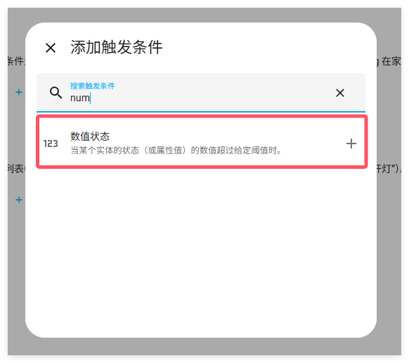
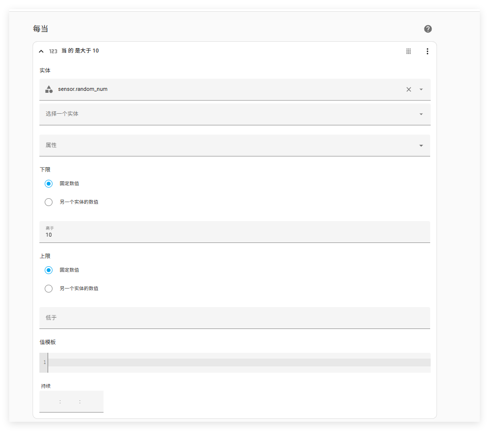
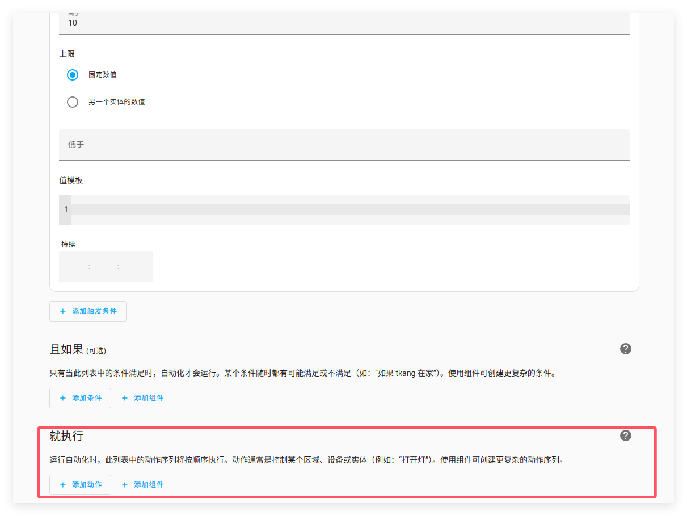
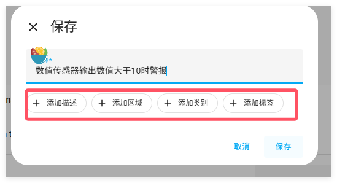
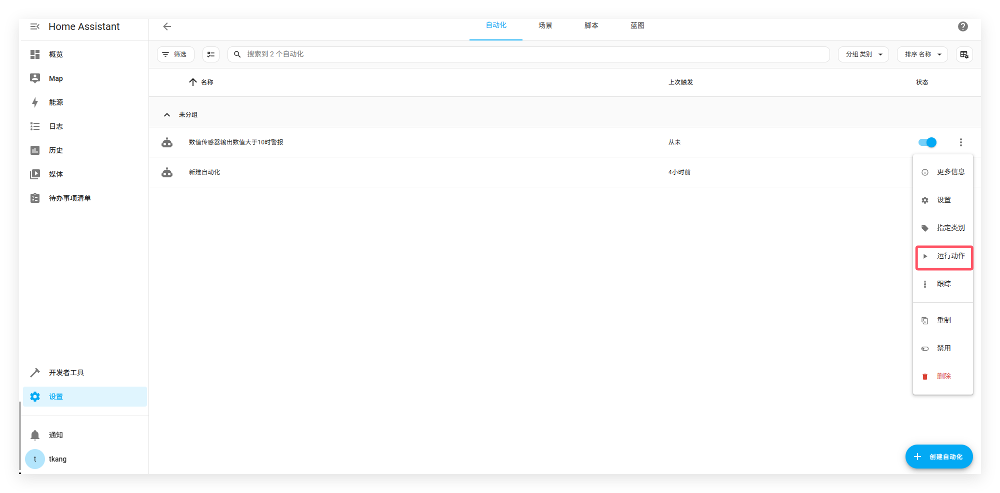
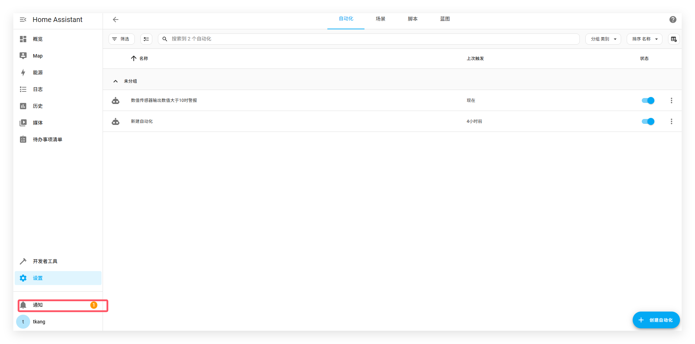
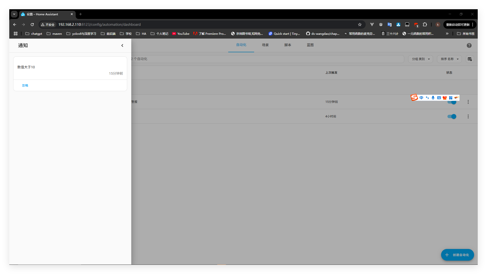

# 自动化编辑器

 自动化编辑器是一种通过界面来创建与编辑自动化的简单方法。

本次教程使用随机传感器，因为它可以生成数据（默认值在是0-20之间）。所以即使你没有真正的传感器,我们也可以完成这个案例。同理,你可以使用任何其它的传感器输出数值类型提供数据。

1. 前往设置->自动化与场景，在右下方拐角处有创建自动化按钮。

2. 点击创建的新自动化

3. 在每当下点击添加触发条件（就是新建触发器），点击新建触发器，搜索栏输入num

   

   - 选择数值状态

   

4. 输入触发条件

   - 定义一个传感器：在实体下输入sensor.random_num

   - 如果传感器的值大于10，我们想要自动化触发

     - 在高于下输入10

       

5. 定义接下来一个发生的动作

   - 在就执行下点击添加动作

   

   6.我们想要创建一个持续存在的通知

   输入No并且选择

   

   7.至于消息内容，我们想要一个简单的文本在展示通知的内容

   

   8.点击报错，给你的自动化一个具有实际意义的名称，并且再次保存。也可添加其它约束条件。

   

   9.返回自动化页面，点击运行按钮，发送通知。

   

   ## 排除缺失自动化的故障

   当使用界面创建自动化时，如果它们没有出现在 UI 中，请确保你在configuration.yaml 中添加了automation: !include automations.yaml
   
   
