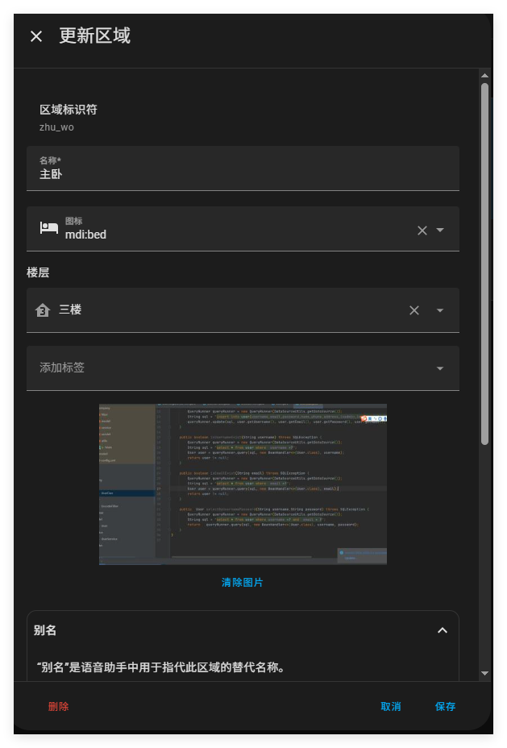
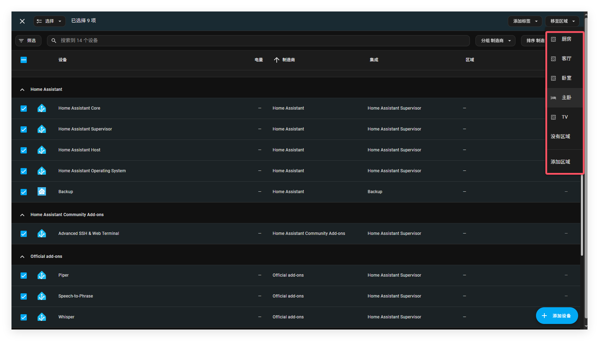
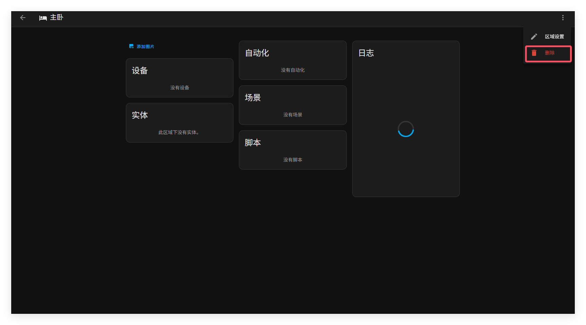

# 区域

**HA中的区域是设备与实体的逻辑分组，并且这个逻辑分组与你的真实世界是一一对应的。**

例如，“客厅” 区域是客厅中的设备和实体分组。区域允许你通过动作来定位整组设备。例如，关闭客厅的所有灯。区域可以被分配到楼层。区域还可以用来自动生成卡片，例如区域卡片。

## 创建区域

按照以下步骤从 “区域” 界面创建一个新区域。

1. 前往设置=》区域，标签与地点，点击创建区域
2. 在弹出框中，输入区域的详细形象
   - 为该区域**命名**（必备）。
   - 添加图标（HA使用[Material 图标](https://pictogrammers.com/library/mdi/)）。
   - 将该区域分配至某一楼层。
     - 如果您尚未创建楼层，您可以[创建一个新楼层](https://www.home-assistant.io/docs/organizing/floors/#creating-a-floor)。
     - 楼层数字可以为负数。例如，对于地下楼层。
     - 楼层数字可用于排序。
   - 添加代表该区域的图像。
   - 添加**别名**
     - 别名是[语音助手](https://www.home-assistant.io/voice_control/aliases/)中用来指代某个区域、实体或楼层的替代名称。
     - 

3. 点击添加

最后，你会成功创建一个区域

## 为楼层分配区域并添加标签

如果某个区域尚未分配到楼层，它会显示在**“未分配区域”**部分。请按照以下步骤将区域分配给楼层。

1. 前往设置=》区域，标签与地点，然后选择**“创建区域”**。
2. 在区域卡上，选择编辑按钮。
3. 在弹出框中，如果你需要的话可以选择楼层并添加标签

## 将区域分配给多个项目

###### 您可以在自动化中一次将一个区域分配给多个项目，场景，脚本和设备页。

1. 根据你的需要前往不同的页面

   - 对于自动化、前往脚本或场景**设置**=>**自动化和场景**并打开相应的选项卡。
   - 对于设备，前往**设置**=>**设备和服务**=>**设备**。

2. 在列表中，选择要分配到区域的所有项目

   

3. 在右上角选择**移动到区域**，然后从列表中选择目标区域。

## 编辑区域

   按照以下步骤编辑区域。

1. 前往**“设置”**= > **“区域、标签和区域”**，然后在区域卡上选择“编辑”按钮。

2. 在对话框中，调整要更改的区域细节：

    - 编辑区域**名称**。

    - 添加图标（HA使用[Material 图标](https://pictogrammers.com/library/mdi/)）。

    - 将该区域分配至某一楼层。

        - 如果您尚未创建楼层，您可以[创建一个新的楼层](https://www.home-assistant.io/docs/organizing/floors/#creating-a-floor)。
        - 该数字可以为负数。例如，对于地下楼层。
        - 该数字稍后可用于排序。

      - 添加代表该区域的图像。

      - 添加

        别名

        - 别名是[语音助手](https://www.home-assistant.io/voice_control/aliases/)中用来指代某个区域、实体或楼层的替代名称。

   

   

   ## 使用区域仪表板

   将实体分配到区域后，即可使用**“区域”**仪表板。**“区域”**仪表板是一个预填充的仪表板，可显示您的实体[按区域分组。要了解如何操作，请参阅区域仪表](https://www.home-assistant.io/dashboards/dashboards/#areas-dashboard)板上的文档。

   

   ## 删除区域

   删除区域请按照以下步骤。删除区域将从所有分配的楼层中移除。所有分配到这个区域的设备都将变成未分配的。并且你在自动化或脚本中使用这个区域作为目标，或者使用语音助手时，区域将不再起作用。

1. 前往 “设置”>“区域、标签和区域”, 然后**选择区域卡片**。

2. 在右上角，选择三点菜单。然后，选择删除。

   

   3.  如果您在自动化或脚本中将此区域用作目标，或使用语音助手，它们将不再起作用。

      - 您可以调整或删除相关的脚本或自动化。

   4. 如果您在该区域仍有设备，则它们不再分配到任何房间。

      - 如果你已经移动了设备，现在可以将它们重新分配到新区域。

      ## 相关主题

      - [区域](https://www.home-assistant.io/docs/organizing/areas/)
      - [对资源进行分组](https://www.home-assistant.io/docs/organizing/)
      - [标签](https://www.home-assistant.io/docs/organizing/labels/)
      - [类别](https://www.home-assistant.io/docs/organizing/categories/)
      - [使用模板中的区域](https://www.home-assistant.io/docs/configuration/templating/#areas)
      - [区域仪表板](https://www.home-assistant.io/dashboards/dashboards/#areas-dashboard)

      ####  **帮助我们改进文档**
