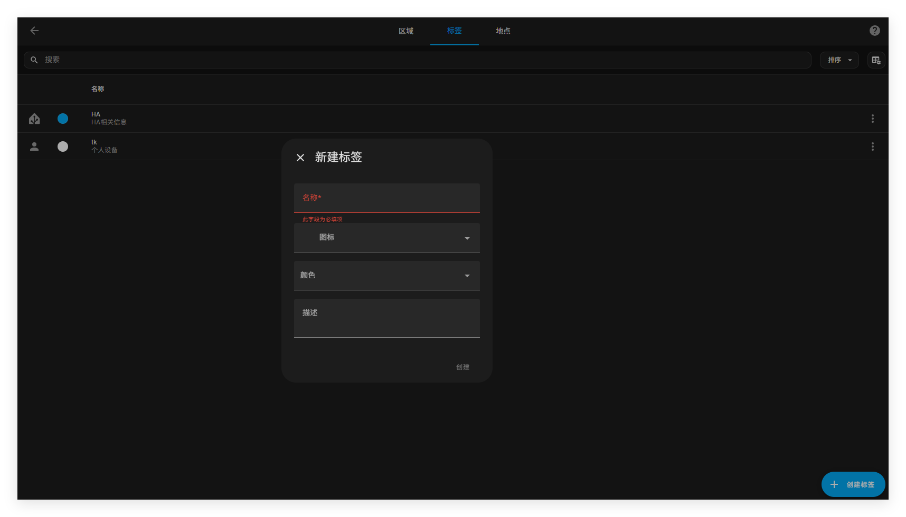
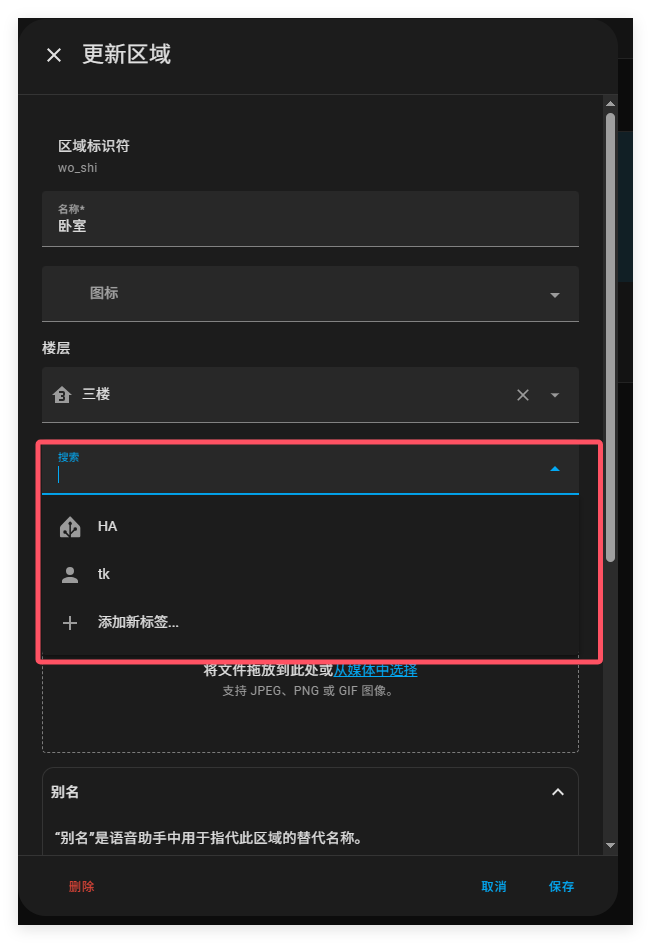
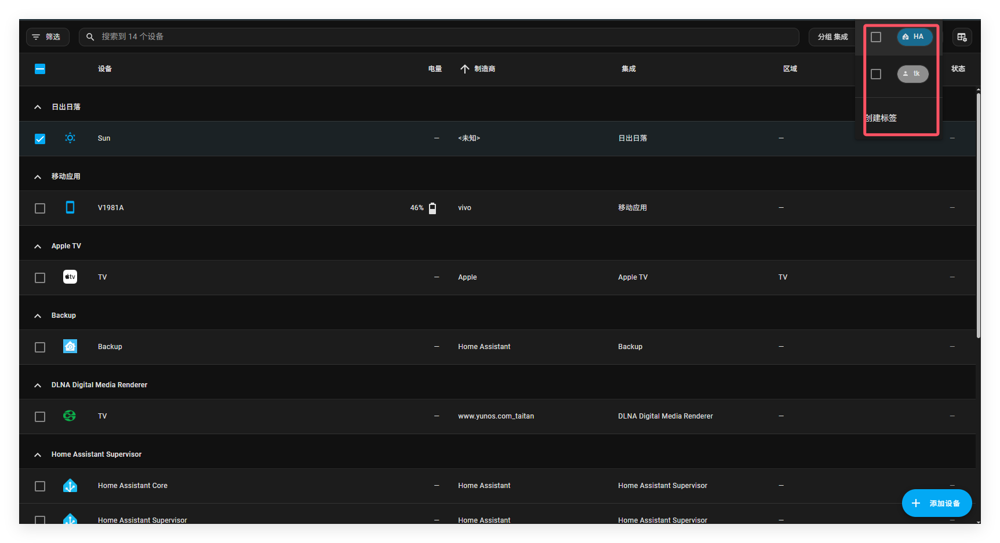

# 标签

HA中的标签可以在不考虑真实地理位置和类型的情况下，对各个元素进行分组。标签可以分配给区域、设备、实体、自动化、场景、脚本和辅助元素。标签可以用于自动化和脚本，作为动作的目标。标签还可以用于过滤数据。

例如，你可以过滤设备列表，只显示标签为重能耗的设备，或者在太阳能供应不足时关闭这些设备。

## 创建标签

按照以下步骤从标签界面创建新标签。

1. 前往设置=》区域，标签和地点，在上方点击标签

2. 点击创建标签按钮

3. 在弹出框中，输入标签详细形象

   - 为标签命名
   - 添加图标
   - 选择颜色

   

4. 点击创建

最终，一个新的标签将会被创建出来

## 应用标签

应用标签需按照以下步骤

1. 给某个区域应用标签

   - 前往设置=》区域，标签和地点

   - 在区域卡片点击编辑按钮

     	

   - 选择一个标签或者新建一个标签
   
2. 对设备,实体,辅助元素应用标签
   - 设置=》设备与服务
   - 点击按钮
   - 在列表中，选择你想应用标签的所有条目
   - 在右上方，点击添加标签。然后，在列表中选择标签。
   - 
   
3. 给自动化，场景和脚本应用标签

   - 前往设置=》自动化和场景，打开各自的标签。
   - 点击按钮。
   - 从列表中，选择所有要应用标签的列表项目。
   - 在右上角，选择三个点菜单，然后选择 “添加标签”。接下来，从列表中选择标签。
   - 

## 删除标签（对于区域，标签和地点）

删除标签需按照以下步骤。它将从所有应用它的列表条目中移除。如果在自动化或脚本中使用此标签作为目标，则需要修改这些标签。

- 前往 “设置”>“区域、标签和地点”, 并在顶部选择 “标签” 选项卡。
- 在标签列表中，找到要删除的标签，然后选择三点菜单。
- 点击删除。
- 如果你在自动化或脚本中使用此标签作为目标，你需要修改这些标签。

## 从表格项中移除标签

1. 转到包含要从中移除标签的元素的数据表：
   - 前往 “设置”>“设备与服务” 并打开相应的选项卡。
   - 或者，前往 “设置”>“自动化与场景” 并打开相应的选项卡。
2. 点击按钮。
   - 从列表中选择所有要删除标签的项目。
   - 在右上角，选择三个点菜单，然后选择**添加标签**。
   - 然后，取消选中要删除的标签的复选框。
   - 相关主题
     - [区域](https://www.home-assistant.io/docs/organizing/areas/)
     - [楼层](https://www.home-assistant.io/docs/organizing/floors/)
     - [类别](https://www.home-assistant.io/docs/organizing/categories/)
     - [在模板中使用标签](https://www.home-assistant.io/docs/configuration/templating/#labels)

