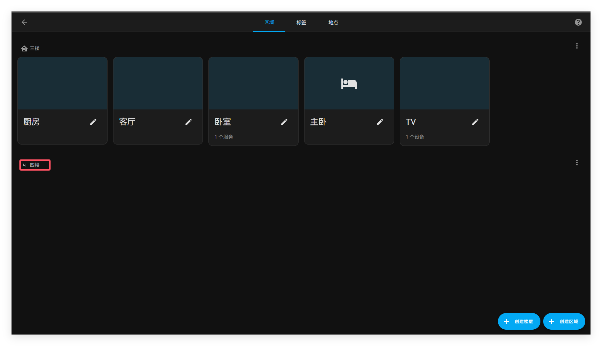
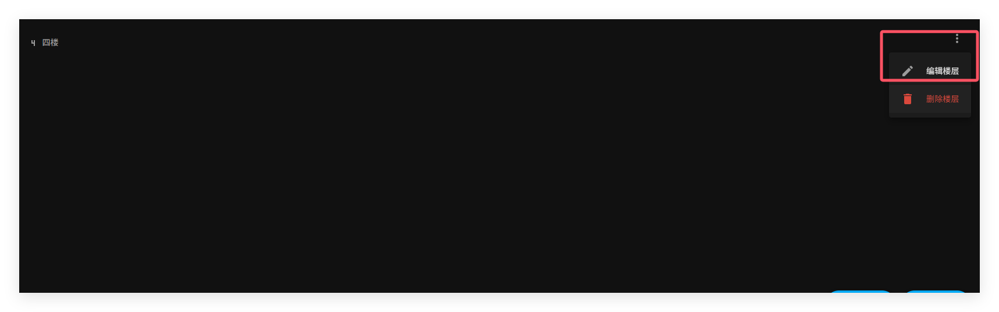

# 楼层

家庭助理中楼层是区域的逻辑分组，与你家真实的楼层一一对应。

设备和实体不能直接分配到楼层，而是分配到区域。楼层可以用于自动化和脚本，作为动作的目标。例如，当你睡觉时，可以关闭下一层楼的所有灯。

## 创建楼层

以下步骤下将新建楼层

1. 前往 “设置”=>“区域、标签和地点”, 然后点击 “创建楼层”。
2. 在弹出框中，输入楼层的详细信息

   - 给楼层命名
   - 输入楼层层数。
   
     - 数字可以是负的。例如，对于地下层数。
   - 这个数字以后可以用于排序。
   - 选择一个楼层图标
   - 添加别名
     - 在语音助手中别名可以用于指代实体、区域或楼层。

3.点击添加

​	最后，新的楼层就被创建出来了

4. 现在你可以分配区域给楼层了

## 删除楼层

删除楼层可以按照以下步骤。分配给楼层的区域将变为未分配区域。以楼层为目标的自动化、脚本或语音助手将不再工作，因为它们不再具有目标。

1.  前往 “设置”=>“区域、标签和地点”, 然后点击 “创建楼层”。

2. 在 “楼层” 旁边，点击三个点菜单，然后选择 “删除地板”。

   

3. 如果你有以楼层为目标的自动化、脚本或语音助手，你需要更新它们。

## 相关主题

- [区域](https://www.home-assistant.io/docs/organizing/areas/)
- [对志愿进行分组](https://www.home-assistant.io/docs/organizing/)
- [标签](https://www.home-assistant.io/docs/organizing/labels/)
- [在模板中使用楼层](https://www.home-assistant.io/docs/configuration/templating/#floors)
- [在语音助手中使用楼层别名](https://www.home-assistant.io/voice_control/aliases/)
