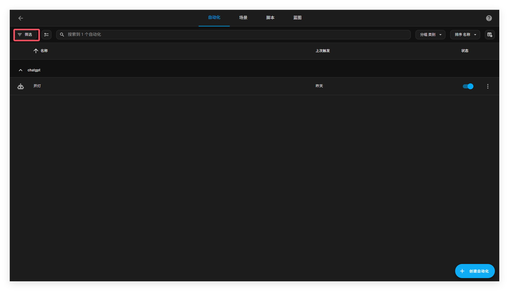
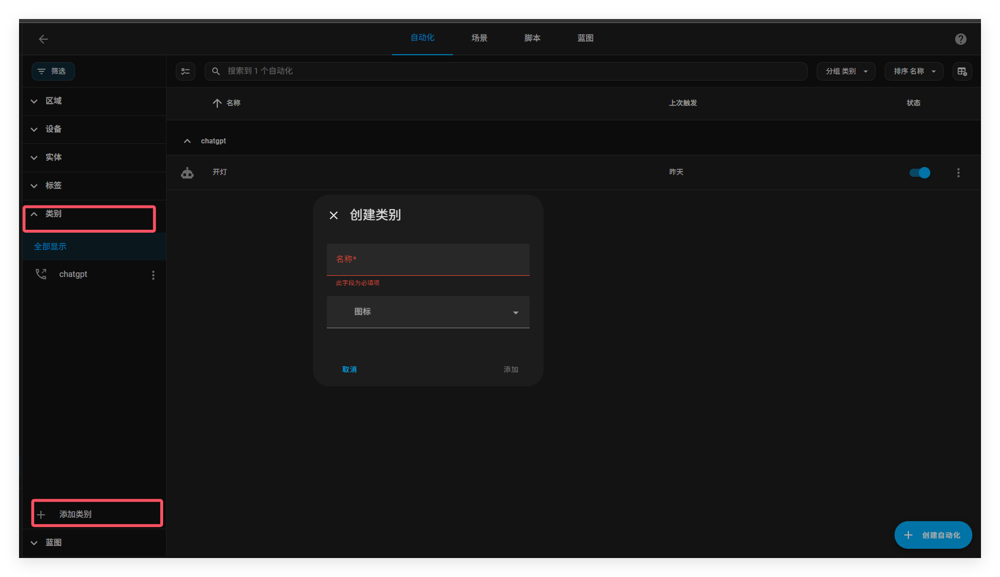

# 类别

###### 通过类别，您可以对表格中的项目进行分组和筛选。与标签类似，类别可以对项目进行分组，而无需考虑其与真实位置的关系。

例如，在自动化页面上，您可以创建“通知”或“NFC 标签”类别，以分组或筛选的方式查看自动化操作。这些类别会在自动化页面上对自动化动作进行分组，而且不会在其他任何位置生效。**每个表格的类别都是唯一的**。自动化页面的类别可以与场景、脚本或助手设置页面的类别不同。

## 创建类别

创建类别需按照以下步骤：

1. 前往设置=》自动化与场景打开相应选项卡

2. 在左上角，选择筛选按钮

   

3. 选择类别，点击添加类别。

   

   最后，会创建新类别

   

   ## 分配类别

   1. 前往[**“设置”** > **“自动化和场景”**](https://my.home-assistant.io/redirect/automations)并打开相应的选项卡。

   2. 要为单个项目分配类别：

      - 在列表中找到该项目并选择三个点菜单。
      - 选择**分配类别**并从列表中选择类别。
      - 如果该类别不在列表中，请选择**添加新类别**并创建一个新类别。

   3. 要将一个类别分配给多个项目：

      - 选择多选按钮。
      - 从列表中选择要应用类别的所有项目。
      - 在右上角，选择**“移至类别”**。
      - 然后，从列表中选择类别。

   4. 一旦应用了类别，表格项目就会按照这些类别分组。

      - 该示例显示了两个类别：咖啡和家政。

      

   ## 编辑或删除类别

   要重命名或删除类别，请按照以下步骤操作：

   1. 转到[**“设置”** > **“自动化和场景”**](https://my.home-assistant.io/redirect/automations)并打开相应的选项卡。

   2. 在左上角，选择**过滤器**按钮。

      

   3. 在列表中，找到要编辑的类别并选择旁边的三个点菜单。

   4. 选择**编辑类别**或**删除类别**。

      

   ## 相关主题

   - [区域](https://www.home-assistant.io/docs/organizing/areas/)
   - [地板](https://www.home-assistant.io/docs/organizing/floors/)
   - [标签](https://www.home-assistant.io/docs/organizing/labels/)

   