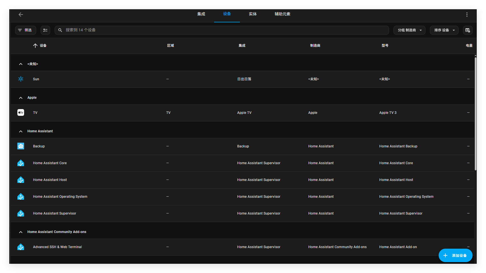

# 表格中使用分组

在使用表格时候，你可以在多选选项。如果你已经把选项分配到楼层，区域，标签或者种类，对各个项进行筛选。

## 表格的多选功能

1. 在你的表格中，点击按钮按钮

   

2. 在该列表中，选择你的选项（其它表格总也可以这样操作）

   

3. 您现在可以将更改应用于所有选定的元素，例如添加标签或移至区域。

### 在表格中过滤筛选

您可以过滤表格，使其只显示符合特定标准的项。

要过滤表格中的项目，请按照以下步骤操作：

1. 在表格的左上角，点击筛选按钮

2. 在筛选的仪表盘，选择你的筛选标准

- 如果你已经定义了楼层，区域，标签和类别就可以根此进行筛选。
- 可选筛选标准取决于表格类型

## 在表格中对项目进行分组与排序

你可以根据一定的标准对项目进行分组。显示的项目数量保持不变，不会隐藏任何项目。

要在表格中对项目进行分组，请按照以下步骤操作：

1. 在表格的右上方，选择分组

   2. 这些项目将根据选择的标准进行分组。

   

   - 可选的分组标准取决于表的类型

     - 示例显示了一个按制造商分组的设备列表。
     - 相比之下，实体表不允许按制造商分组，而是按实体域进行分组。

     

3. 对选项进行分组，选择排序按钮

   

4.为了更好的浏览，你可以在列表中折叠分组。

## 自定义表格列

您可以显示或隐藏列并更改顺序。您的自定义列存储在浏览器中，因此您只需要设置一次，下次访问该页面时就会使用它。

自定义表格列，可以按照以下步骤操作

1. 在表格的右上角，选择齿轮
2. 为了隐藏列，取消选择
3. 要重新对表格列排列，可以拖动表格列到新位置
4. 需要排序的话，可以点击需要排序的表格列（可以进行升序或降序排序）

## 相关话题

- [地板](https://www.home-assistant.io/docs/organizing/floors/)
- [标签](https://www.home-assistant.io/docs/organizing/labels/)
- [区域](https://www.home-assistant.io/docs/organizing/areas/)
- [类别](https://www.home-assistant.io/docs/organizing/categories/)
- [对资产进行分组](https://www.home-assistant.io/docs/organizing/)
- [启用或禁用实体和自动化](https://www.home-assistant.io/common-tasks/general/)

#### 