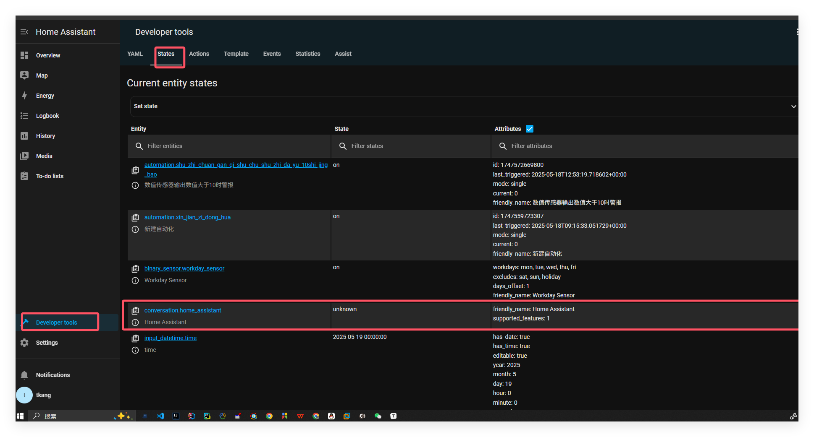
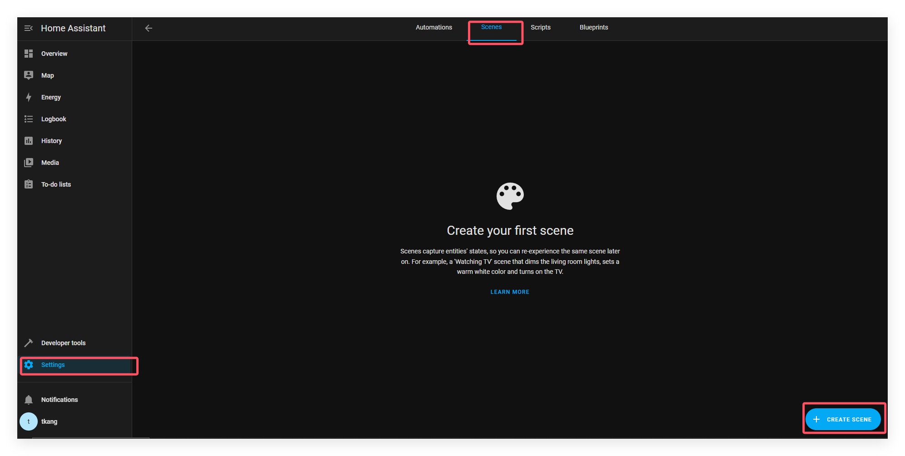
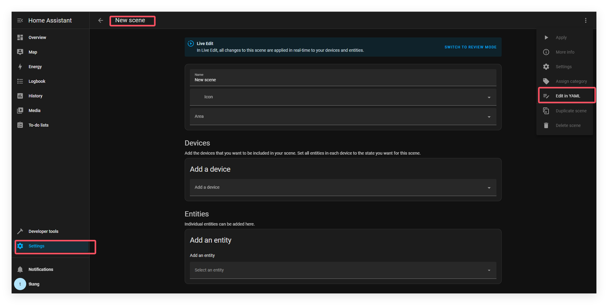

# 场景

你可以通过场景（scene）来让你的指定的实体变成某种状态。举个例子，场景可以指定灯 A 打开，灯 B 是亮红色。

```yml
# Example configuration.yaml entry
scene:
  - name: Romantic
    entities:
      light.tv_back_light: "on"
      light.ceiling:
        state: "on"
        xy_color: [0.33, 0.66]
        brightness: 200
  - name: Movies
    entities:
      light.tv_back_light:
        state: "on"
        brightness: 125
      light.ceiling: off
      media_player.sony_bravia_tv:
        state: "on"
        source: HDMI 1
```

## 如何配置场景

在scene块中，你可以使用以下所需的参数

| 字段名     | 类型   | 是否必填 | 说明                                       |
| ---------- | ------ | -------- | ------------------------------------------ |
| `name`     | string | ✅ 是     | 建议易理解，不混淆（显示名称）。           |
| `entities` | list   | ✅ 是     | 要控制的实体及其目标状态，格式为实体列表。 |

有两种方式来设置每个实体（entity_id）的状态

- 直接使用实体定义的状态。请注意，需要定义该状态。

- 使用复杂的状态与属性。开发者工具 -> 状态下可以查看特定实体的所有可用属性。

  

HA的界面非常离谱，支持的功能使用一个位图来展示例如`supported_features: 2564`,不同的集成的不同位还表示不一样，例如

以 `cover`（窗帘/窗户等）为例，Home Assistant 定义的功能位如下：

| 功能说明          | 数值（十进制） | 二进制位（从右往左） |
| ----------------- | -------------- | -------------------- |
| OPEN              | 1              | 第 0 位              |
| CLOSE             | 2              | 第 1 位              |
| STOP              | 4              | 第 2 位              |
| OPEN_TILT         | 16             | 第 4 位              |
| CLOSE_TILT        | 32             | 第 5 位              |
| STOP_TILT         | 64             | 第 6 位              |
| SET_POSITION      | 128            | 第 7 位              |
| SET_TILT_POSITION | 256            | 第 8 位              |
| POSITION          | 1024           | 第 10 位             |
| TILT              | 2048           | 第 11 位             |

`supported_features` 是一个整数，表示该实体支持哪些功能。
 它的每一位（二进制）代表一个功能是否开启：

- 如果某个功能的位为 1，表示支持；
- 位为 0，表示不支持。

## 使用未定义的场景

使用 scene.apply 操作，可以使用未定义的场景。相反，您将状态作为数据的一部分传递。数据的格式与配置中的实体字段相同

```yml
# Example automation
automation:
  triggers:
    - trigger: state
      entity_id: device_tracker.sweetheart
      from: "not_home"
      to: "home"
  actions:
    - action: scene.apply
      data:
        entities:
          light.tv_back_light:
            state: "on"
            brightness: 100
          light.ceiling: off
          media_player.sony_bravia_tv:
            state: "on"
            source: "HDMI 1"
```

## 使用场景过渡

scene.apply 和 scene.turn_on 操作都支持设置过渡，这使你能够平滑地过渡到场景。

这是一个浪漫场景的例子，其中光线将在 2.5 秒内过渡到场景。

```yml
# Example automation
automation:
  triggers:
    - trigger: state
      entity_id: device_tracker.sweetheart
      from: "not_home"
      to: "home"
  actions:
    - action: scene.turn_on
      target:
        entity_id: scene.romantic
      data:
        transition: 2.5
```

使用过渡的前提条件，过渡目前只支持灯光，而灯光也必须支持过渡才行。然而，场景本身并不一定只由灯光组成，才能形成过渡场景。

## 重新加载场景

无论何时更改场景配置，都可以调用 scene.reload 操作来重新加载场景。

## 编辑处




