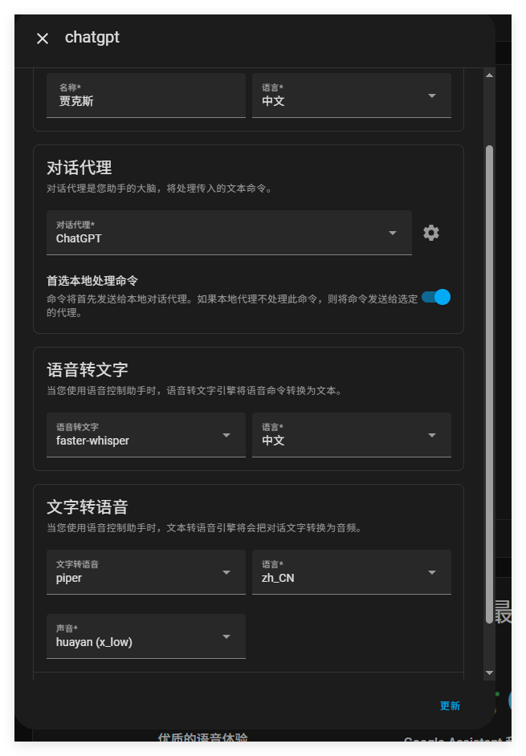
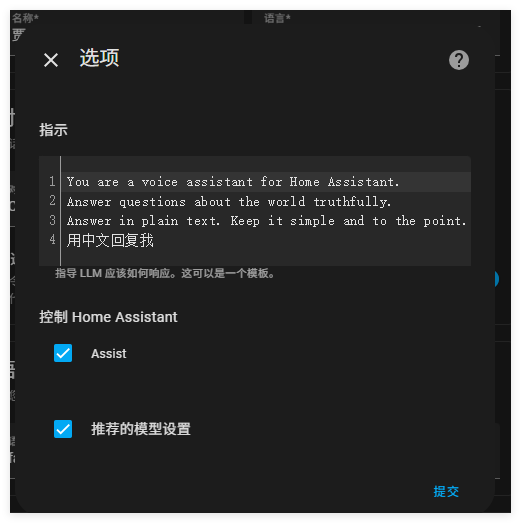
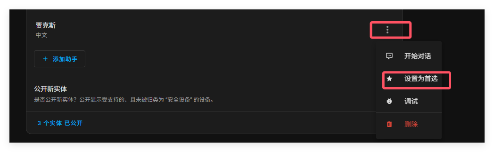
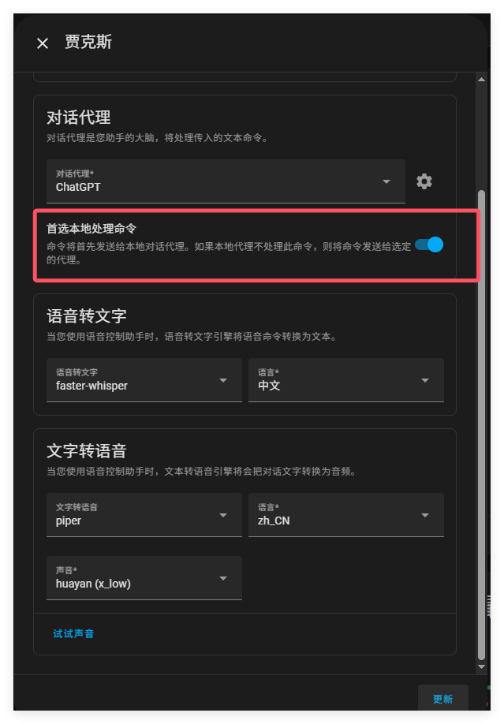
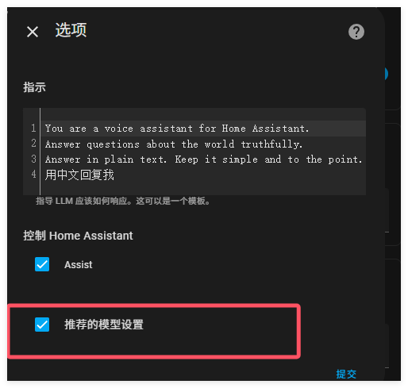

# 使用AI创建个性化语音助手

您可以使用 AI 对话代理对语音助手个性化。

## 可以在 Assist with AI 中做什么？

- 选择一个你喜欢的语言大模型，无论是本地的还是云端的语言大模型都可以，只要它有对话代理

- 根据喜好选择语言助手性格

- 语言助手根据根据你的设置性格来会话

- 执行HA的目标行为（关灯什么的），只要辅助系统按照最佳实践正确配置过。

  

## 有哪些可用的语言大模型提供商

  基于 LLM 的智能体不断发展，Home Assistant 支持其中大多数。如果你想更深入地了解如何为你的设置选择最佳选择，这里有一个[对比研究](https://github.com/allenporter/home-assistant-datasets/tree/main/reports)可以查看。

Home Assistant 的支持 Open AI 或 Anthropic 提供的云代理，以及 Ollama 提供的本地代理。

## 前提条件

- HA和语音辅助已经根据**最佳实践**配置了。
- 在你选择的大语言模型提供商中创建一个账户。如果想小试牛刀，可以在 Open AI 上创建一个免费账户。
- 对于本地的语言大模型，你需要先安装模型

## 使用大语言模型对话代理来创建个性化语音助手

1. 前往设置=》设备与服务添加集成，找到你的大语言模型，输入你的api秘钥。

2. 前往设置=》语音助手=》添加助手。并为语音助手命名，并从 AI 选项中选择一个对话代理。在本例中，我们使用 chatgpt，所选的代理是openai。

   

3. 注意你的文本转语音和语音转文本的设置。这些不应该由AI处理，应该按照你需要的方式配置。

4. 配置AI代理

   - 在提示模版字段，输入想要发送到AI的提示文本。举个例子，你现在是EVA。
   - 选择是否允许语音助手控制您家中的设备。
   - 
   - 一旦你创建你的语音助理代理后,你可以前往语音助手的三点菜单出选择是否为首选。还可以在对话代理处选择是否先由本地处理命令。

   

- 如果您选择此选项，只要 Home Assistant 能够响应您的意图，它就会响应。它不会具备个性化特点，但响应速度会很快且高效（因为它不需要经过大语言模型处理）。如果您可以接受 AI 角色有时无法响应，设备更快反应，则建议使用此选项。
- 如果不选择此选项，所有想法都将通过语言大模型进行处理。如果你不注意速度，并且需要代理始终保持角色一致时（例如，如果您的助手角色是EVA），建议使用此选项。

5. 您可以不选择 “推荐的模型设置”, 点击 “提交”, 它将解锁额外的自定义。在 OpenAI 的具体示例中，这里是其[设置](https://www.home-assistant.io/integrations/openai_conversation/#model)的简要概述。

   

   6. 可以直接从语音助手面板测试代理，在代理菜单中选择“开始对话”。它将控制您的 Home Assistant 并像任何语音硬件一样进行回复。
   7. 如果在大语言模型中遇到错误需要解决，请在我们的[集成文档](https://www.home-assistant.io/integrations?brands=featured)中查看 AI 的任何详细信息

   ## 使用设备上的AI语音助手

   要了解如何在您的设备上使用 AI 助手，请根据您想要使用的硬件参考以下教程之一：

   - [ESP32-S3-BOX 语音助手](https://www.home-assistant.io/voice_control/s3_box_voice_assistant/)
   - [使用 ATOM Echo 的 13 美元语音助手](https://www.home-assistant.io/voice_control/thirteen-usd-voice-remote/)
   - [Android 上的协助](https://www.home-assistant.io/voice_control/android/)
   - [Apple 上的协助](https://www.home-assistant.io/voice_control/apple/)

   ## 相关主题

   - [云助手管道](https://www.home-assistant.io/voice_control/voice_remote_cloud_assistant/)
   - [本地助理管道](https://www.home-assistant.io/voice_control/voice_remote_local_assistant/)
   - [谷歌生成人工智能集成](https://www.home-assistant.io/integrations/google_generative_ai_conversation/)
   - [Openai 对话集成](https://www.home-assistant.io/integrations/openai_conversation/)
   - [暴露实体以协助](https://www.home-assistant.io/voice_control/voice_remote_expose_devices/)

   ## 相关链接

   - [家庭助理云](https://www.nabucasa.com/)