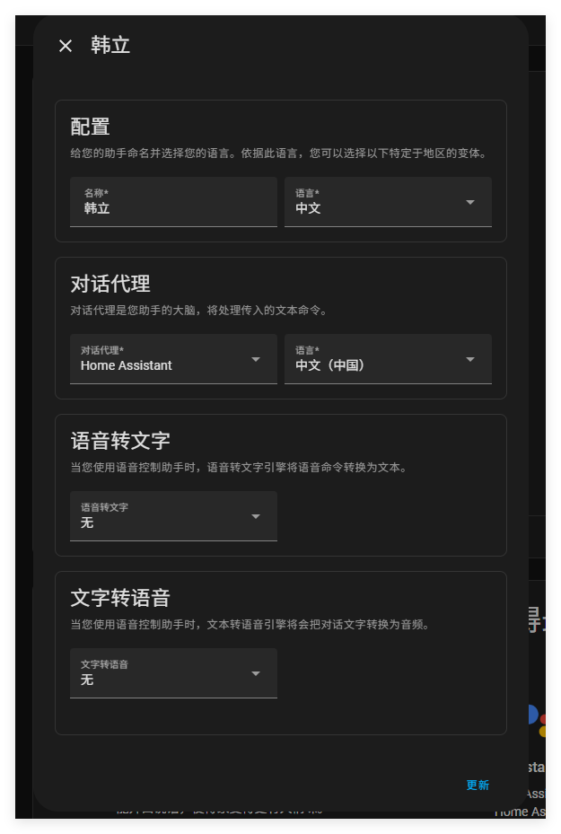

# 开始-本地

**使用Assist最简单有效的方式是利用Home Assistant Cloud中包含的语音提供商（提供了文本转语音和语音转文本的两种功能）**。

如果你仍然对完全使用本地语音助手感兴趣，请遵循以下的配置。

## 前提条件

为了让语音助手可以与你的Home Assistant交流，你需要让你的语音助手可以倾听声音，理解意图，最后反馈。

在Home Assist中，各种各样的组件搭建出辅助管道（pipeline ）最后构建语音助手了

语音助手。对不同组件你有可以不同的选择。

- 对于语音聆听与反馈来说，它需要你的手机安装HA的APP，或者有个语音激活设备。
- 对于理解语音，你需要有一个文本转语音和语音转文本的集成。
- 为了让二者同时运行，你需要运行一个HA操作系统。

## 文本转语音和语音转文本的可选项

HA有完全本在地运行的语音转文本和文本到语音选项。不会将数据发送到外部服务器进行处理。

### 语音转文本引擎

对于本地运行的语音转文本的引擎有两个，**Speech-to-Phrase** and **Whisper**。

#### Speech-to-Phrase

[Speech-to-Phrase](https://github.com/OHF-voice/speech-to-phrase)是封闭的语音模型。

- 它将其所知道的内容转录下来。
- 即使在 Home Assistant Green 或 Raspberry Pi 4 上也能实现极快的转录（不到一秒）。
- 仅支持 Assist 的部分语音命令。
  - 购物清单、命名计时器和广播等更多开放式项目*不能*开箱即用。
- Speech-to-Phrase 支持[多种语言](https://github.com/OHF-voice/speech-to-phrase?tab=readme-ov-file#supported-languages)

### Whisper 

whisper是一种开放式的语音演讲模式。

- 它会尝试转录所有的功能

- 当时速度较慢
  - 在 Raspberry Pi 4 上，处理传入的语音命令大约需要 8 秒。
  - 在英特尔 NUC 上，该操作可在一秒钟内完成。
  
- 只有在以下情况下，Whisper 才是一个很好的选择：
  1. 你家里有强大的硬件。
  2. 您计划扩展语音助手设置，使其不再局限于简单的家居控制。例如，将您的语音助手与大模型配合。
  
  

## 文本转语音引擎

​	对于文字转语音功能，我们开发了Piper，Piper 是一款快速的利用本地神经网络进行文本转语音系统，音质出色，Piper 针对 Raspberry Pi 4 进行了优化。它支持 [多种语言](https://rhasspy.github.io/piper-samples/)，在中等质量的树莓派型号上使用，一秒钟可以产生1.6秒的语音。


## 安装本地辅助管道

按照以下步骤操作，可以最快的方式启动您的本地辅助管道：

1. 安装文本转语音和语音转文本的附件。

   - 安装您选择的语音转文本插件，[**Speech-to-Phrase**](https://my.home-assistant.io/redirect/supervisor_addon?addon=core_speech-to-phrase)或[**Whisper**](https://my.home-assistant.io/redirect/supervisor_addon?addon=core_whisper)。

   - 安装[**Piper**](https://my.home-assistant.io/redirect/supervisor_addon?addon=core_piper)以实现文本转语音功能。

   - 启动加载项。

   - 启动加载项后，转到

     **“设置”** > **“设备和服务”**

     下的集成。

     - [您现在应该看到](https://www.home-assistant.io/integrations/wyoming/)Wyoming发现了这两项服务。

2. 对HA进行设置

   - 前往设置=>语音助手，点击添加助手

   

   - 常见错误：如果你在此处并没有看到任何的助手，说明你没有使用默认配置。在这种情况下：你需要添加一下配置在你的configuration.yaml 文件中。

   - ```
     # Example configuration.yaml entry
     assist_pipeline:
     ```

   - 输入名称，你可以选择任何对你有意义的名称。

   - 选择你对话的语言

   - 在对话代理这里选择HA

   - 在文字转语音这里

3. 就是这样，你要保证你的语音命令可以在本地的设备上使用。

4. 如果你还没有做到，对语音助手公开你的设备。

   - 除非你不想用语音控制你的设备。


## 为Whipser和Piper微调你的设备

如果想调整配置以获得更好的性能或准确性吗？请观看下面视频中的一些选项。由 Rasspy、Piper 和 Wyoming 的创始人 Mike Hansen 解释。

加载项本身也记录了这些选项。访问 Whisper 或 Piper 附加组件并打开 “**文档”** 页面。


## 学习更多关于Speech-to-Phrase的知识

您可以查看语音第 9 章，了解更多关于我们为什么引入语音到句子，以及为什么它是家庭控制的绝佳选择的信息。


## 下一步

一旦辅助设置完成后，就开始使用它了。您现在可以通过设备 (Android、iOS 或语音预览版) 进行通话。

为了更好地使用语音互动，不要忘记检查是否执行了最佳实践。


## 相关主题

- [语音助手的最佳实践](https://www.home-assistant.io/voice_control/best_practices/)
- [拓展语音助手](https://www.home-assistant.io/voice_control/expanding_assist/)
- [创建本地语音助手](https://www.home-assistant.io/voice_control/voice_remote_local_assistant/)
- [公开设备给语音助手](https://www.home-assistant.io/voice_control/voice_remote_expose_devices/)

## 相关链接

- [语音预览版 - 文档](https://support.nabucasa.com/hc/en-us/categories/24451727188125-Home-Assistant-Voice-Preview-Edition)