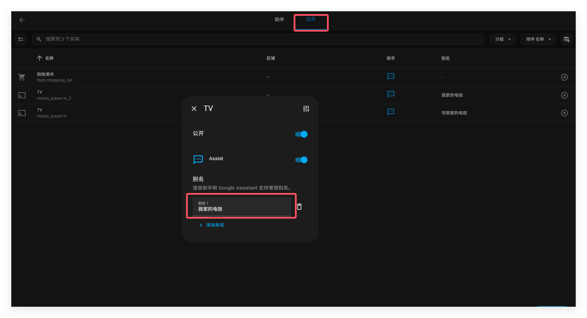
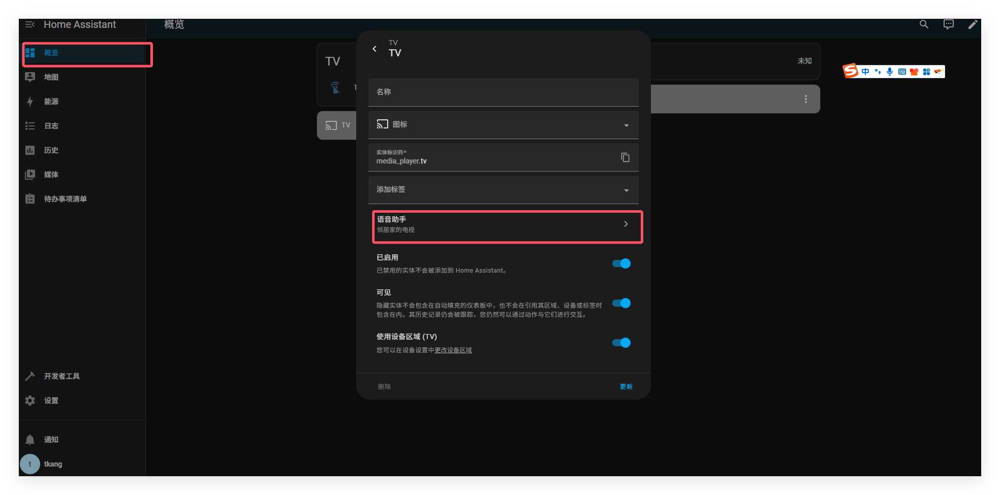

# 取别名-实体、区域和楼层

语音助手将使用你的实体、区域和楼层的名称，以及你配置的所有别名。而且，配置的别名不仅仅可以给语音助手使用，如果你已经设置了Google Assistant，Google Assistant 也可以使用。

在您可以使用多个名称呼叫同一设备，或者使用多种语言对话语音助手的情况，这些别名会很有用。

## 为实体添加别名

有多种方式可以为实体添加别名

- 方式1：前往**设置**=》**语音助手**。在**开放公开标签页，点击你想添加别名的实体。
- 
- 方式2：

## 为区域添加别名

1. 为区域添加别名，需要前往设置=》区域，标签&地点。
2. 在需要添加别名的区域卡片上，选择铅笔按钮。
3. 选择添加别名输入你想为区域取的别名。
4. 保存你的更改。

## 为楼层添加别名

1. 为了给楼层添加别名，前往设置=》设置=》区域，标签&地点。
2. 在感兴趣的楼层，选择更多（三个点）菜单，然后点击编辑楼层。
3. 选择 “添加别名”, 然后输入您想要用于该楼层的别名。
4. 保存你的更改

### 具有分配区域的实体的无区域别名

建议将区域添加到实体规范名称中，例如客厅灯。但是，由于Assist既可以推断区域，也可以在语句中明确提取区域，因此最好为所有公开的实体添加简单的别名。例如，为“客厅灯”（Living room lamp）设置“灯”（Lamp）这个别名，可以让你在对客厅的语音终端（卫星）发出指令时，既可以说“打开客厅的灯”，也可以直接说“打开灯”来控制它。

即使你有卧室灯不用担心，你也可以为那盏灯取别名，区别客厅里面的灯，在与区域名称 (客厅或卧室) 相关联时才会被匹配。

## 相关主题

- [区域](https://www.home-assistant.io/docs/organizing/areas/)
- [楼层](https://www.home-assistant.io/docs/organizing/floors/)
- [协助自定义句子](https://www.home-assistant.io/voice_control/custom_sentences/)

####  **帮助我们改进文档**
