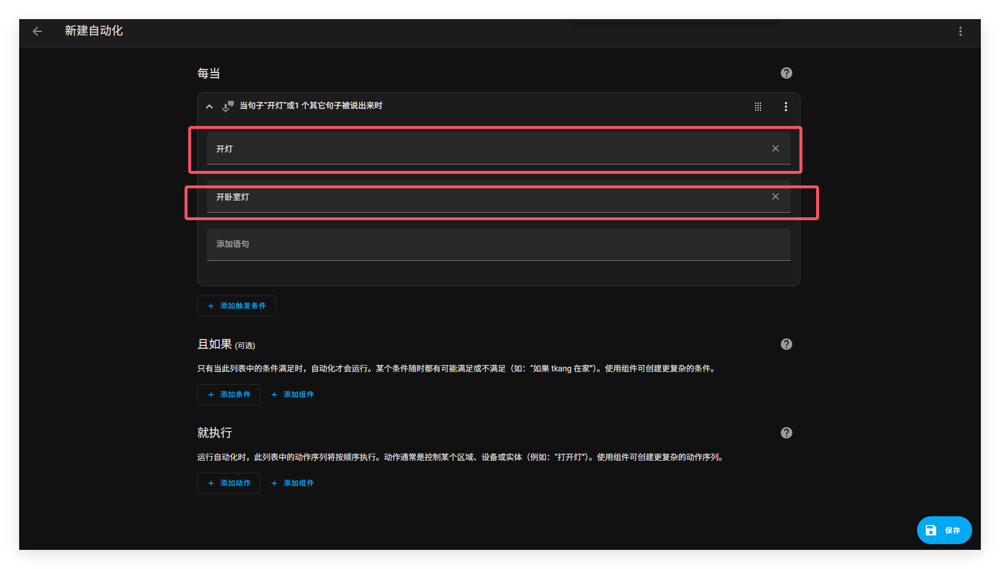

# 添加自定义语句以触发自动化

你可以通过扩展现有意图（[intent](https://developers.home-assistant.io/docs/intent_builtin/) ）或创建新的意图来将自己的句子添加到意图识别器中。你还可以针对现有意图自定义响应。

## 前提条件

### 需求

你需要一个正在工作的语音助手配置。如果你还没有，请查看辅助语音助手的入门页，为你的设置打好基础。

### 添加自定义语句以触发自动化

有一个最简单的方法入门自动化中的自定义语句。

1. 前往设置=》自动化与场景，在右下方的拐角处，点击**创建自动化**。

2. 在**触发器**的下拉菜单，点击**语句**

3. 输入一个或者多个你想用来触发触发器的语句

   - 不要使用标点符号
   - 你可以添加多个句子。然后它们都会触发这个自动化。
   - 

   4. 为了添加自定义回复，选择添加动作。下滑选择其他动作=》设置对话响应

   5. 在文本框中，输入你想从语音助手中听到的回复，点击保存

      - 你可以使用通配符，举个例子，这个触发器

        ```
        play {album} by {artist}
        ```

      - 可以这样回复

        ```
        Playing {{ trigger.slots.album }} by {{ trigger.slots.artist }}
        ```
   
        可以在[对话回复脚本动作](https://www.home-assistant.io/docs/scripts/#respond-to-a-conversation)中查看更多细节
   
   6. 为了测试这个自动化，前往概览并且在右上方拐角处，打开语音助手
   
      - 输入你设置的其中一个语句
   
   7. 如果它没有运行，查看常见问题部分
   
      - 其中一个原因可能是你的目标设备没有公开给语音助手。
   
   8. 拿出语音控制设备，说出自定义语句
   
      - 你的自动化现在应该是触发了
### 在 configuration.yaml 中设置自定义语句

要在配置文件中设置自定义句子，请按照[本教程](https://www.home-assistant.io/voice_control/custom_sentences_yaml/)操作。


## 相关设备及安装教程

- [售价 13 美元的 Home Assistant 语音助手](https://www.home-assistant.io/voice_control/thirteen-usd-voice-remote/)
- [S3-BOX-3语音助手](https://www.home-assistant.io/voice_control/s3_box_voice_assistant/)
- [Apple 协助](https://www.home-assistant.io/voice_control/apple/)
- [Android 助手](https://www.home-assistant.io/voice_control/android/)

## 相关主题

- [创建别名](https://www.home-assistant.io/voice_control/aliases/)
- [对话响应脚本操作](https://www.home-assistant.io/docs/scripts/#respond-to-a-conversation)
- [句子触发器](https://www.home-assistant.io/docs/automation/trigger/#sentence-trigger)
- [句子通配符](https://www.home-assistant.io/docs/automation/trigger/#sentence-wildcards)

## 相关链接

- [查看现有意图](https://developers.home-assistant.io/docs/intent_builtin/)
