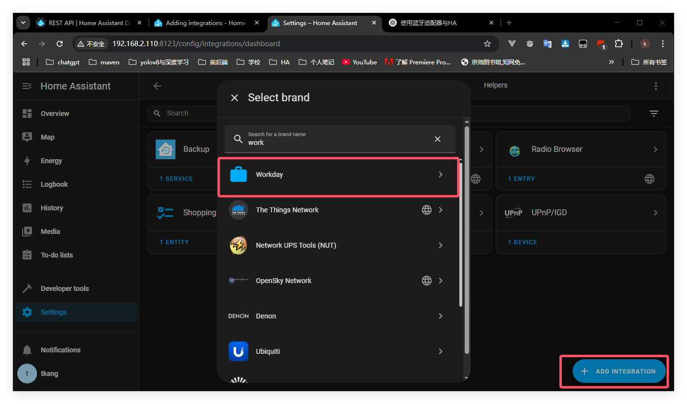

# 添加集成

教程的开始，让我们来添加你的第一个集成（工作日集成）。它可以根据工作日、休息日或节假日来自动化变化。这次教程不需要智能设备。

## 教程前提

本教材假设你已经安装了Home Assistant，并且至少完成了基础登录步骤。

## 添加集成 

1. 前往设置->设备与服务
   - 集成（集成不是仪表盘，所以没有相应操作，改变视图布局什么的）页面显示了您已安装的所有集成。其中一些是自动安装的。
   - 如果设备已经被探查出来了，你将会在页面的发现区域看见它。

2.探查到新设备后就可以添加它们了

- 在此情况下，在相应的集成卡片（不是弹出框）下点击添加。
- 如果需要其他配置，请按照 UI 中的步骤操作
- 如果设备没有被自动探测到，我们将会在下一步添加一个集成。

3.如果设备没有被自动探查从来，在右下方拐角处，点击添加集成。
4.在搜索页面输入workday,点击

5.为它配置一个名字，例如明日工作，然后选择国家

- 当地假期由国家决定

- 选择提交，然后结束

6.配置选项

- 举个例子，如果星期一对于你来说是工作日，选择x去掉它。
- 要查看明天是否是工作日，请在延后天数下输入 1。
- 要查看明天是否是工作日，请在 “偏移” 下输入 1。
- 点击提交

7.选一个区域，举个例子，办公室，然后点击结束

8.现在你可以在列表中看到工作日集成了

## 查询集成详细信息

1. 点击集成
 

- 打开了集成详细信息页面

- 我们可以看到集成有一个设备一个服务

- 点击文档选项可以打开此集成的文档页面

- 点击已知问题将会打开GitHub的问题追踪器，筛选出有关这个集成的相关问题，让你看到其它用户反馈的相关问题

- 开启集成调试日志可以开始记录该集成的日志，再次点击后将保存日志。

2.点击服务，打开服务信息页面

- 在日志中，你可以看到传感器的时间线
- 你可以看到集成提供的所有传感器。在这里，我们只有一个传感器，但如果你有一个气候设备，你可能会在这里看到温度、湿度和电池状态。
- 您还可以看到 Workday (目前) 尚未在任何自动化、脚本或场景中使用。
  - 

3.点击 “返回” 按钮。然后，选择 “实体” 以打开实体列表。
- 即使你的你的HA已经有了很多实体，你在此处的实体表中也只能看到一个实体（筛选过了）。

- 你可以看到实体编号，由域与实体名称组成，格式为：domain_entity_name.

  
  

4.更改集成

  1. 修改名称可以点击三点菜单，然后点击修改名称。

     

  2. 你也可以添加另一个工作日传感器，例如你想知道你的同事什么时候放假。

     - 选择添加条目，给他命名定义你的选项
- 选择你感兴趣的国家。

- 如果你感兴趣可以点击[这个](https://www.home-assistant.io/integrations/workday/)
