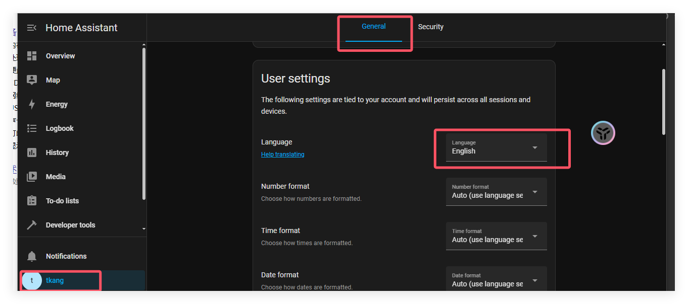
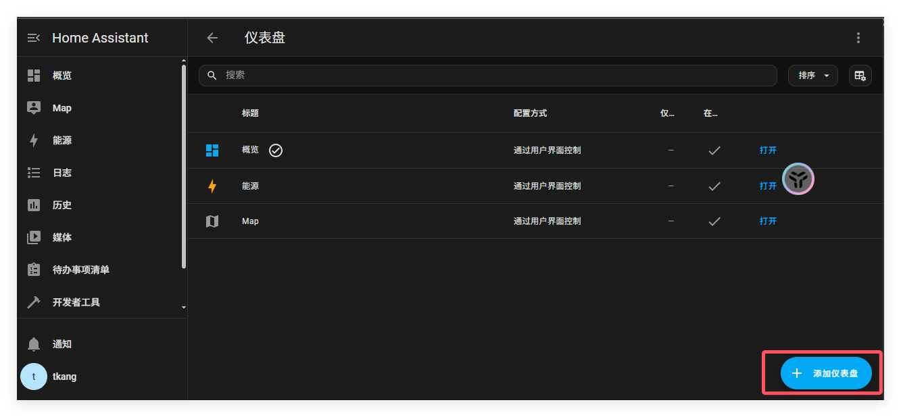
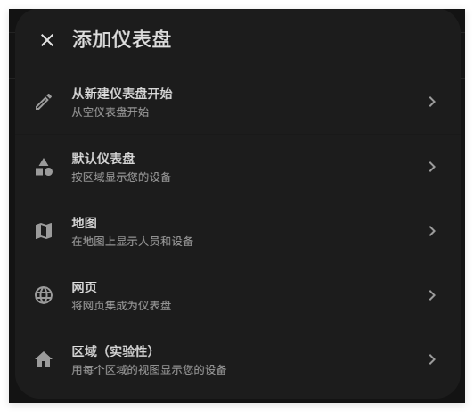
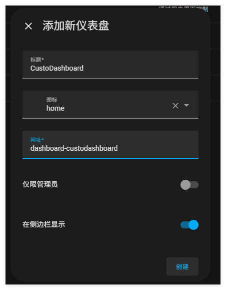

# HomeAssistant编辑仪表盘

仪表盘是一个显示你的家庭智能设备的可以自定义配置的页面。

## 写在前面

可以在此处点击语言模式

## 仪表盘 卡片 视图

该截图展示了仪表盘的概览，仪表盘中包含了许多用来展示传感器值的卡片。举个例子，有一些灯的状态，一个媒体播放器的状态，还有一些传感器的数值。它也展示了一些控制组件，你可以通过他们来改变通风情况，灯的颜色，开启小电视，开启youtube。

## 视图

以下截图展示了一个填满的仪表盘，该仪表盘以墙砖视图布局（就是对图标不同类型的放置方式），每一个顶部蓝色图标菜单都代表了不同的tab页面，每个tab都包含视图。

以下截图显示了一个完整填充的仪表板，在分区视图布局中显示。

## 其他的仪表盘类型

在左边的侧边栏中，你可以看到不同仪表盘的名称。Home Assistant 提供了不同类型的仪表盘。

1. 概览
2. 能源
3. 地图
4. 日志
5. 历史
6. 待办事项清单

## 概览仪表盘的首次尝试

概览仪表盘是你登录后看到的第一个页面

如果你是第一次登陆，你的概览仪表盘页面差不多是空的。首次登录的页面是砌体布局，以卡片形式展示了自动探测到的设备，不同家庭的仪表盘可能很不一样，这和你家设备的不同有关。

好了，接下来让我们看看，HA检测到的家具，以及在概览仪表盘中对应的设备卡片。

- 搜诺斯牌扬声器：媒体控制器卡片。
- 人形卡片（离开状态）：一个实体卡片。
- 天气预报卡片：没什么好说的。
- 温度传感器卡片：实体卡片。

### 搜诺斯牌扬声器卡片

如果你有一个连接了wifi的智能扬声器，它应该会被HA检测到。

### 人形卡片

登录后，第一个出现在这里的一个是房子的主人。在人名旁边，显示了该人的状态是离开。你可以持续监测某人是否在场，把这个作为条件创建自动化。

### 天气预报卡片

如果你在登陆时候提供了位置，天气预报卡会自动显示（官方的在中国境内不准）。

### 温度传感器卡片

因为此处使用HA的树莓派设备，内置了一个蓝牙模块，而且此处有两个蓝牙传感器设备。如果你的HA没有内置蓝牙模块，你家中的蓝牙设备不会显示。

当然如果你的HA有其他控制器，例如Zigbee和Z-Wave，并且你有这两种设备，他们应该都可以被检测到并在此显示，但是你记得要先配对。

## 创建新仪表盘与编辑卡片

这个默认的概览仪表盘会在你添加新设备时候自动更新，但是你只要编辑过这个仪表盘，它就不会再自动更新了。因此，我们可以自己新建一个仪表盘，让默认的概览仪表盘永远自动更新。

1. 在设置->仪表盘中点击新建仪表盘

   

2. 在弹框中，点击默认仪表盘

   

3. 在添加仪表盘对话框中，输出仪表盘名和图标

   - 不要在仅管理员和在侧边栏显示两个选项输入。

   - 点击创建

   - 最后会在左侧侧边栏中显示。

     

4. 左侧侧边栏打开你新建的仪表盘，并在屏幕右上方点击  按钮。

5. 通过编辑仪表盘，你将完全接管这个仪表盘。这意味着以下几点。

   - 新仪表盘组件（包括各种卡片，图标等）可以使用时候不再自动添加到仪表盘。

   - 随后，在弹出框中点击接管。
   - 在确认前点击阅读并接受。
   - 从此你不能让仪表板自动恢复更新。但是，您可以创建一个新的默认仪表板

6. 你的仪表盘现在可能还没有很多元素。

   - 如果你家里有智能家居设备，其中一些可能已经自动连接。
   - 在下面这个示例中，一些蓝牙温度传感器自动连接了。
   - 此处的一些卡片是默认添加的，例如天气预报，设置系统的人物卡片还有一个文字转语音服务（官方的现在还是个人工智障）。

7. 接下来，举个例子，编辑天气卡片。

   - 点击天气卡片。
   - 然后，点击齿轮。

8. 更改你想改的选项

   - tmd别改实体id

   - 改完点击更新

     

9. 接下来，我们为天气服务添加一个新卡片

   - 再次点击天气卡片，点击，然后点击设备信息
   - 在传感器下，点击添加到，点击添加到仪表盘，然后点击不同的卡片。
   - 

10. 下列列表中,点击当前天气预报

11. 点击展示在卡片上的细节

   - 

   - 保存你的更改

   - 现在你可以在仪表盘是看到预报卡片了. 

12. 现在我们删掉其他的天气卡片
- 在右上方拐角处，点击铅笔
- 
- 在卡片上，点击三个点然后删除

13. 最后，我们想把天气卡片移动到左侧拐角处。
    - 在卡片底部，点击数字在弹出框输入或点击加减号键输入。
    - 如果你想移动卡片，可以在其它任何卡片上重复操作。
    - 当你结束移动后，卡片在右方拐角处后，选择完成。

14. 如果您想更改其他任何的卡片虚心，请点击卡片上的 “编辑” 按钮

15. 恭喜你！你已经完成了第一个仪表盘的自定义工作。

16. 当你的仪表盘还比较小的时候，这是个好机会把它迁移到分区视图中。

    - 分区视图提供拖放、自定义列数和宽度以及更多标题选项等功能。

    - 要了解更多信息，请访问分区视图中的文档。

 ## 了解有关仪表板的更多信息

如果您想了解有关仪表板、视图和卡片的更多信息，请查看以下主题：

- 查看[仪表板的介绍](https://www.home-assistant.io/dashboards/)并了解[仪表板类型](https://www.home-assistant.io/dashboards/dashboards)
- 了解有关[视图类型的更多信息](https://www.home-assistant.io/dashboards/views/)
- 了解如何向视图[添加卡片。](https://www.home-assistant.io/dashboards/cards/#adding-cards-to-your-dashboard)
